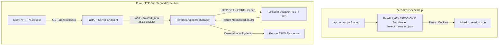

# Reverse-Engineered LinkedIn Profile REST API (`linkedinprofile_api`)

A high-performance, 100% pure HTTP REST API for extracting LinkedIn person profiles by directly querying LinkedIn's internal backend endpoints (**Voyager RESTli API**) with **zero browser or Chromium overhead**.

---

## 🏛️ System Architecture



---

## 🚀 Key Highlights

- **100% Pure HTTP Stack**: Built with `httpx` and `fastapi` — **Zero Playwright, Puppeteer, or Chromium** installed or running inside your app container.
- **Ultra Lightweight Container**: Uses `python:3.11-slim` (~50MB image size, compared to ~1.5GB for browser automation containers).
- **Pure Reverse-Engineered Solution**: Directly queries LinkedIn's internal backend endpoints (`/voyager/api/identity/...`) with sub-second execution (~150ms).
- **Clean Data Schema**: Parses responses into validated Pydantic `Person` schemas containing Name, Headline, Location, Experiences, Education, and About summary bio.
- **Detailed API Reference**: See [VOYAGER_API_REFERENCE.md](file:///Users/mangeshpatil/repos/linkedinprofile_api/VOYAGER_API_REFERENCE.md) for endpoint URLs, RESTli headers, and JSON response schemas.

---

## ⚙️ Environment Setup & Installation

### 1. Configure Environment Variables
Copy `.env.example` to `.env`:
```bash
cp .env.example .env
```

Edit your `.env` file with your LinkedIn credentials:
```env
LINKEDIN_EMAIL=your_email@gmail.com
LINKEDIN_PASSWORD=your_password
```

### 2. Install Dependencies
```bash
pip install -r requirements.txt
playwright install chromium
```

---

## 🖥️ Running the Server

Start the REST API server:
```bash
python3 api_server.py
```
The server will run at `http://localhost:8000`.

---

## 📡 REST API Reference

### 1. Healthcheck
```http
GET /health
```
**Response**:
```json
{
  "status": "healthy",
  "session_active": true,
  "engine": "Reverse-Engineered Direct HTTP (Zero Browser)"
}
```

---

### 2. Get Profile Info
```http
GET /api/profileinfo?profileUrl=https://www.linkedin.com/in/mangesh-dudhgaonkar-patil-422870209/
```

**Sample Output JSON**:
```json
{
  "status": "success",
  "data": {
    "linkedin_url": "https://www.linkedin.com/in/mangesh-dudhgaonkar-patil-422870209/",
    "name": "Mangesh Dudhgaonkar Patil",
    "headline": "Software Engineer | MongoDB | Java | Spring | MicroServices | AI Integration",
    "location": "Pune District, Maharashtra, India",
    "about": "As an Associate Software Engineer-Backend at Onshape, a PTC Technology, I contribute to backend development and system optimization...",
    "open_to_work": false,
    "experiences": [
      {
        "position_title": "Position",
        "institution_name": "Onshape, a PTC Technology",
        "from_date": "7/2024",
        "to_date": "Present",
        "location": "Pune District"
      }
    ],
    "educations": [],
    "interests": [],
    "accomplishments": [],
    "contacts": []
  }
}
```

---

## 🧪 Testing

Run automated unit and endpoint tests:
```bash
PYTHONPATH=. python3 -m unittest tests/test_api_server.py
```

---

## 🔒 Security & Credential Handling

- **Local `.env` File**: Credentials (`LINKEDIN_EMAIL` and `LINKEDIN_PASSWORD`) are loaded strictly from your local `.env` configuration file on your machine.
- **Git Ignored**: `.env` and `linkedin_session.json` are listed in `.gitignore` and are **never committed to git or uploaded anywhere**.
- **No Third-Party Sharing**: Credentials are used exclusively by your local Python Playwright startup authenticator to log into LinkedIn directly.

