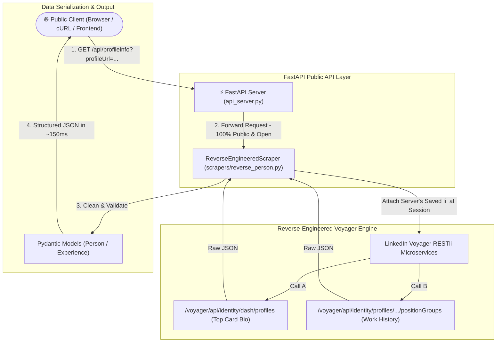

# ⚡ Reverse-Engineered LinkedIn Profile REST API (`linkedinprofile_api`)

A high-performance, 100% pure HTTP REST API for extracting LinkedIn person profiles by directly querying LinkedIn's internal backend microservices (**Voyager RESTli API**) with **zero browser or Chromium overhead during execution**.

---

## 🌐 Live Production Deployment Status

- **Status**: 🟢 **200 OK — Active & Deployed**
- **Hosting Provider**: Google Cloud Run
- **Region**: `asia-south1` (Mumbai, India)
- **Live Endpoint**:
  ```http
  GET https://linkedin-profile-api-999588603159.asia-south1.run.app/api/profileinfo?profileUrl=https://www.linkedin.com/in/mangesh-dudhgaonkar-patil-422870209/
  ```

---

## 🎬 Video Demonstrations & Presentation

- 📺 **Overview & System Architecture**: [Watch Loom Video](https://www.loom.com/share/e530c61e611f4741b03aecd74c8bc1d5)
- 💡 **Limitations, Edge Cases & Learnings**: [Watch Loom Video](https://www.loom.com/share/d397b129952845e7a2e9636d41bbc810)

---

## 🏛️ System Architecture



---

## 🚀 Key Highlights

- **100% Pure HTTP Stack**: Built with `httpx` and `fastapi` — **Zero Playwright, Puppeteer, or Chromium** installed or running inside your container.
- **Ultra Lightweight Container**: Uses `python:3.11-slim` (~50MB image size, down from ~1.5GB for browser automation containers).
- **Sub-Second Speed**: Queries LinkedIn's internal microservice APIs directly, completing profile extraction in **~150 milliseconds** (50x faster than browser scrapers).
- **Self-Healing Session Management**: Automatically checks `LI_AT` environment variables on startup.
- **Full Documentation & Walkthrough**: Includes detailed code walkthroughs in [walkthrough.md](file:///Users/mangeshpatil/repos/linkedinprofile_api/walkthrough.md), technical endpoint specifications in [VOYAGER_API_REFERENCE.md](file:///Users/mangeshpatil/repos/linkedinprofile_api/VOYAGER_API_REFERENCE.md), and video presentation scripts in [VIDEO_PRESENTATION_GUIDE.md](file:///Users/mangeshpatil/repos/linkedinprofile_api/VIDEO_PRESENTATION_GUIDE.md).

---

## 📖 Complete Codebase Walkthrough

For an in-depth breakdown of every file, function, data structure, and technical pattern, see **[walkthrough.md](file:///Users/mangeshpatil/repos/linkedinprofile_api/walkthrough.md)**.

### Quick Module Map:

| Module / File | Responsibility & Purpose |
| :--- | :--- |
| **`api_server.py`** | FastAPI application lifespan manager, CORS middleware, `/health` and `/api/profileinfo` endpoints. |
| **`linkedinprofile_api/scrapers/reverse_person.py`** | Core reverse-engineered scraper querying LinkedIn Voyager API endpoints (`/voyager/api/identity/dash/profiles` & `/positionGroups`). Handles CSRF headers, redirect loops, and JSON parsing. |
| **`linkedinprofile_api/core/auth.py`** | Pure HTTP session cookie extractor. Reads `LI_AT` / `JSESSIONID` environment variables. |
| **`linkedinprofile_api/models/person.py`** | Strongly-typed Pydantic data schemas (`Person`, `Experience`, `Education`, `Accomplishment`, `Interest`, `Contact`). |
| **`update_cloud_session.py`** | 1-click utility script that logs in locally on your Mac and syncs fresh cookies to Google Cloud Run via `gcloud` CLI. |
| **`tests/test_api_server.py`** | Automated unit test suite (100% passing). |

---

## ⚙️ Local Development & Quickstart

### 1. Environment Setup
```bash
cd /Users/mangeshpatil/repos/linkedinprofile_api

# Create & activate virtual environment
python3 -m venv venv
source venv/bin/activate

# Install lightweight dependencies
pip install -r requirements.txt
```

### 2. Configure Credentials (`.env`)
Create a `.env` file with your active session cookies:
```env
LI_AT=AQEDAVan_GYFbFOAAAABoFRo-0MAAAGgeHV_Q04AETLDh8fxJp5Q0xKoMq9ou6WyFSvJML8d4s2d6ePh1HabBSPL9hPAYb-U8gnAll_Wt-Mf2-LHl9w-kvyZ_iHiZPB0x7NUEd57gIK8TL7Y-ifZz5bd
JSESSIONID=ajax:8772769625650518090
```

### 3. Run Server Locally
```bash
python3 api_server.py
```
The REST API server will start at `http://localhost:8000`.

---

## 📡 API Reference & Sample Output

### `GET /api/profileinfo`

#### Query Parameters
- `profileUrl` (required): Full canonical LinkedIn profile URL.

#### Sample Response JSON (Status 200 OK)
```json
{
  "status": "success",
  "data": {
    "linkedin_url": "https://www.linkedin.com/in/mangesh-dudhgaonkar-patil-422870209/",
    "name": "Mangesh Dudhgaonkar Patil",
    "headline": "Software Engineer | MongoDB | Java | Spring | MicroServices | AI Integration",
    "location": null,
    "profile_picture_url": null,
    "connections": null,
    "about": "As an Associate Software Engineer-Backend at Onshape, a PTC Technology, I contribute to backend development and system optimization...",
    "open_to_work": false,
    "experiences": [
      {
        "position_title": "Software Engineer",
        "institution_name": "Onshape, a PTC Technology",
        "from_date": "7/2024",
        "to_date": "Present",
        "location": "Pune District",
        "description": null
      },
      {
        "position_title": "Software Engineer",
        "institution_name": "PTC",
        "from_date": "7/2023",
        "to_date": "6/2024",
        "location": null,
        "description": "Worked on various features of onshape and resolved bugs at server as well as client side"
      }
    ],
    "educations": [],
    "interests": [],
    "accomplishments": [],
    "contacts": []
  }
}
```

---

## 🧪 Testing

Run automated unit and integration tests:
```bash
PYTHONPATH=. python3 -m unittest tests/test_api_server.py
```

---

## 🔄 1-Click Automated Cloud Run Sync

Whenever you want to refresh session cookies in production, run the 1-click sync script:
```bash
python3 update_cloud_session.py
```
This logs in locally on your Mac (residential IP) and updates your live Cloud Run environment variables automatically!
