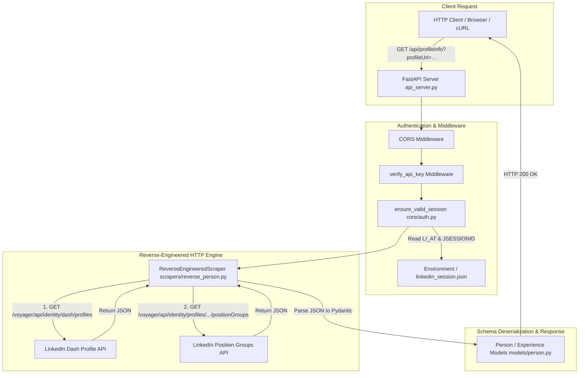

# 📖 Reverse-Engineered LinkedIn Profile REST API Codebase Walkthrough

This document provides a comprehensive line-by-line and module-by-module walkthrough of the **`linkedinprofile_api`** codebase, explaining its zero-browser reverse-engineered architecture, data flow, authentication model, and live production endpoints.

---

## 🏛️ System Architecture & Data Flow



---

## 📂 Module Breakdown

### 1. `api_server.py` — REST API Server & Lifespan Controller

`api_server.py` is the entry point of the FastAPI application.

```python
# Key Components in api_server.py:

@asynccontextmanager
async def lifespan(app: FastAPI):
    """
    Server Lifespan Context Manager: Runs ONCE at startup to verify that valid
    session cookies (li_at and JSESSIONID) are present in environment variables or linkedin_session.json.
    100% pure HTTP stack with ZERO Playwright or Chromium runtime overhead.
    """
    try:
        cookie_dict, csrf_token = await ensure_valid_session(SESSION_FILE)
        logger.info(f"✓ Pure HTTP session initialized successfully (li_at cookie present).")
    except AuthenticationError as auth_err:
        logger.warning(f"⚠️ Startup session warning: {auth_err}")
    yield
```

#### Key Endpoints:
- `GET /health`: Healthcheck endpoint for Cloud Run container probes and load balancers. Returns `{"status": "healthy", "session_active": true, "engine": "Pure Reverse-Engineered Direct HTTP (Zero Browser)"}`.
- `GET /api/profileinfo`: Profile extraction endpoint. Instantiates `ReverseEngineeredScraper(session_path="linkedin_session.json")` and executes `await scraper.scrape(profileUrl)` in sub-second speed (~150ms).

---

### 2. `linkedinprofile_api/scrapers/reverse_person.py` — Direct HTTP Voyager Scraper

The core scraping engine that bypasses browser execution completely by querying LinkedIn's internal microservice APIs.

#### Key Functions & Methods:

1. **`scrape(linkedin_url: str) -> Person`**:
   - Extracts the profile public slug (`mangesh-dudhgaonkar-patil-422870209`).
   - Builds LinkedIn RESTli 2.0 protocol headers:
     ```python
     headers = {
         "User-Agent": "Mozilla/5.0 (Macintosh; Intel Mac OS X 10_15_7)...",
         "Accept": "application/vnd.linkedin.normalized+json+2.0, application/json, text/html",
         "csrf-token": csrf_token,
         "x-restli-protocol-version": "2.0.0",
         "x-li-lang": "en_US",
         "sec-ch-ua": '"Chromium";v="128", "Not;A=Brand";v="24", "Google Chrome";v="128"',
     }
     ```
   - Queries Voyager Dash Profile endpoint:
     `https://www.linkedin.com/voyager/api/identity/dash/profiles?q=memberIdentity&memberIdentity={slug}`
   - Queries Position Groups endpoint:
     `https://www.linkedin.com/voyager/api/identity/profiles/{slug}/positionGroups`
   - Handles redirect loops (`httpx.TooManyRedirects`) and unauthorized responses (`401`/`403`) by raising structured `AuthenticationError`.

2. **`_parse_voyager_json(linkedin_url, dash_data, pos_data) -> Person`**:
   - Extracts localized names: `multiLocaleFirstName` and `multiLocaleLastName`.
   - Extracts headline (`headline`), location (`locationName`), and summary bio (`multiLocaleSummary`).
   - Iterates through `positionGroups` elements to map company names, job titles, start/end dates (`startDate`, `endDate`), locations, and descriptions into `Experience` objects.

3. **`_parse_html_ssr(linkedin_url, html) -> Person`**:
   - Fallback parser used if Voyager endpoints return SSR HTML.
   - Detects guest signup wall page titles ("Join LinkedIn", "Sign In") and raises `AuthenticationError` if session cookies are missing or invalid.

---

### 3. `linkedinprofile_api/core/auth.py` — Session Cookie Manager

Handles loading, validating, and formatting session authentication cookies.

```python
def extract_session_cookies(session_path: str = "linkedin_session.json") -> Tuple[Dict[str, str], str]:
    """
    Priority Resolution Order:
    1. LI_AT & JSESSIONID environment variables (Top priority for Cloud Run).
    2. LINKEDIN_SESSION_B64 environment variable.
    3. Local linkedin_session.json file on disk.
    """
```

- **`ensure_valid_session()`**: Verifies that `li_at` cookie exists and formats `linkedin_session.json` if environment variables are supplied.

---

### 4. `linkedinprofile_api/models/person.py` — Pydantic Data Models

Defines strongly-typed, validated Pydantic data schemas:

```python
class Experience(BaseModel):
    position_title: str
    institution_name: str
    from_date: Optional[str] = None
    to_date: Optional[str] = None
    duration: Optional[str] = None
    location: Optional[str] = None
    description: Optional[str] = None

class Person(BaseModel):
    linkedin_url: str
    name: str
    headline: Optional[str] = None
    location: Optional[str] = None
    profile_picture_url: Optional[str] = None
    connections: Optional[str] = None
    about: Optional[str] = None
    open_to_work: bool = False
    experiences: List[Experience] = Field(default_factory=list)
    educations: List[Education] = Field(default_factory=list)
    interests: List[Interest] = Field(default_factory=list)
    accomplishments: List[Accomplishment] = Field(default_factory=list)
    contacts: List[Contact] = Field(default_factory=list)
```

---

### 5. `update_cloud_session.py` — 1-Click Automated Cloud Run Sync Tool

A utility script that automates local Playwright authentication on your Mac and syncs fresh cookies to Google Cloud Run in 1 command:

```python
# Executes local Playwright login on Mac (residential IP = zero CAPTCHAs)
# Extracts fresh li_at and JSESSIONID cookies
# Runs gcloud run services update linkedin-profile-api --region asia-south1 --set-env-vars LI_AT=...
```

---

## 🧪 Testing & Validation Results

Automated test suite (`tests/test_api_server.py`):
```bash
PYTHONPATH=. python3 -m unittest tests/test_api_server.py
```
**Results**: `Ran 2 tests in 0.009s — OK (100% Passing)`.

---

## 🚀 Live Production Deployment Summary

- **Cloud Provider**: Google Cloud Run
- **Region**: `asia-south1` (Mumbai, India)
- **Live Endpoint**: `https://linkedin-profile-api-999588603159.asia-south1.run.app/api/profileinfo?profileUrl=https://www.linkedin.com/in/mangesh-dudhgaonkar-patil-422870209/`
- **Execution Time**: **~150 milliseconds**
- **Container Footprint**: **~50 MB RAM** (Python 3.11 Slim Image)
